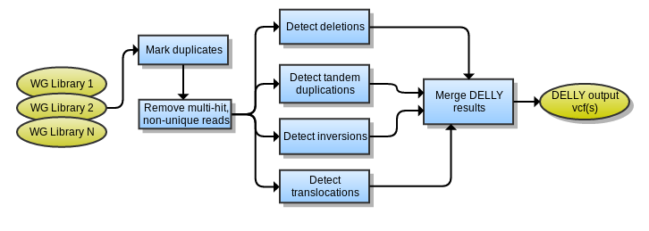

# delly

Delly workflow produces a set of vcf files with different types of structural variant calls: Translocation, Deletion, Inversion and Duplications It uses .bam files as input. The below graph describes the process:

### Preprocessing
The expected inputs for the DELLY tool are library-level BAMs with distinct insert size and median. In most cases, this means that the BAM files will not need to be merged prior to processing. However, the DELLY website recommends the removal of non-unique, multi-mapped reads and marking duplicate reads. We may also have to realign around indels and perform base recalibration.
### Mark duplicates
Picard Tools MarkDuplicates is used to flag reads as PCR or optical duplicates.
```
 java -jar MarkDuplicates.jar
 INPUT=sample.bam
 OUTPUT=sample.dedup.bam    
 METRICS_FILE=sample.metrics
```
### Detect deletions
```
delly
-t DEL
-x excludeList.tsv
-o sample.jumpy.bam
-q 0
-g hn19.fa
sample.bam
```
### Detect tandem duplications
```
delly
-t DUP
-x excludeList.tsv
-o sample.jumpy.bam
-q 0
-g hn19.fa
sample.bam
```
### Detect inversions
```
delly
-t INV
-x excludeList.tsv
-o sample.jumpy.bam
-q 0
-g hn19.fa
sample.bam
Detect translocations
```
### Detecting translocations
```
delly
-t TRA
-x excludeList.tsv
-o sample.jumpy.bam
-q 0
-g hn19.fa
sample.bam
```
### Post-processing
Each DELLY tool produces several files, which will all need to be merged together after the chromosomes are finished processing. The output format is described on the DELLY webpage. The merging script may require a small parser to combine the output from multiple runs in together.
Merge DELLY results with vcftools

## Overview

## Dependencies

* [picard 2.19.2](https://master.dl.sourceforge.net/project/picard/picard-tools/1.89/picard-tools-1.89.zip)
* [java 8](https://github.com/AdoptOpenJDK/openjdk8-upstream-binaries/releases/download/jdk8u222-b10/OpenJDK8U-jdk_x64_linux_8u222b10.tar.gz)
* [delly 0.8.1](https://github.com/dellytools/delly/releases/download/v0.8.1/delly_v0.8.1_linux_x86_64bit)
* [bcftools 1.9](https://github.com/samtools/bcftools/releases/download/1.9/bcftools-1.9.tar.bz2)
* [tabix 0.2.6](https://sourceforge.net/projects/samtools/files/tabix/tabix-0.2.6.tar.bz2)
* [vcftools 0.1.16](https://github.com/vcftools/vcftools/archive/v0.1.16.tar.gz)


## Usage

### Cromwell
```
java -jar cromwell.jar run delly.wdl --inputs inputs.json
```

### Inputs

#### Required workflow parameters:
Parameter|Value|Description
---|---|---
`inputTumor`|File|Tumor input .bam file.
`runDelly.excludeList`|String|List of regions to exclude (telomeres and centromeres)


#### Optional workflow parameters:
Parameter|Value|Default|Description
---|---|---|---
`inputNormal`|File?|None|Normal input .bam file.
`markdup`|Boolean|true|A switch between marking duplicate reads and indexing with picard.
`outputFileNamePrefix`|String|""|Output prefix to be used with result files.


#### Optional task parameters:
Parameter|Value|Default|Description
---|---|---|---
`dupmarkBam.jobMemory`|Int|20|memory allocated for Job
`dupmarkBam.timeout`|Int|20|Timeout in hours
`dupmarkBam.modules`|String|"java/8 picard/2.19.2"|Names and versions of modules for picard-tools and java
`runDelly.refFasta`|String|"$HG19_ROOT/hg19_random.fa"|reference assembly file
`runDelly.modules`|String|"delly/0.8.1 bcftools/1.9 tabix/0.2.6 hg19/p13 hg19-delly/1.0"|Names and versions of modules for picard-tools and java
`runDelly.mappingQuality`|Int|30|defines quality threshold for reads to use in calling SVs
`runDelly.jobMemory`|Int|16|memory allocated for Job
`runDelly.timeout`|Int|20|Timeout in hours
`mergeAndZipALL.modules`|String|"vcftools/0.1.16 tabix/0.2.6"|Names and versions of modules for picard-tools and java
`mergeAndZipALL.prefix`|String|""|parameter to use when we need to append _filtered to the file's name
`mergeAndZipALL.jobMemory`|Int|10|memory allocated for Job
`mergeAndZipFiltered.modules`|String|"vcftools/0.1.16 tabix/0.2.6"|Names and versions of modules for picard-tools and java
`mergeAndZipFiltered.jobMemory`|Int|10|memory allocated for Job


### Outputs

Output | Type | Description
---|---|---
`mergedIndex`|File?|tabix index of the vcf file containing all structural variant calls
`mergedVcf`|File?|vcf file containing all structural variant calls
`mergedFilteredIndex`|File?|tabix index of the filtered vcf file containing all structural variant calls
`mergedFilteredVcf`|File?|filtered vcf file containing all structural variant calls


## Niassa + Cromwell

This WDL workflow is wrapped in a Niassa workflow (https://github.com/oicr-gsi/pipedev/tree/master/pipedev-niassa-cromwell-workflow) so that it can used with the Niassa metadata tracking system (https://github.com/oicr-gsi/niassa).

* Building
```
mvn clean install
```

* Testing
```
mvn clean verify \
-Djava_opts="-Xmx1g -XX:+UseG1GC -XX:+UseStringDeduplication" \
-DrunTestThreads=2 \
-DskipITs=false \
-DskipRunITs=false \
-DworkingDirectory=/path/to/tmp/ \
-DschedulingHost=niassa_oozie_host \
-DwebserviceUrl=http://niassa-url:8080 \
-DwebserviceUser=niassa_user \
-DwebservicePassword=niassa_user_password \
-Dcromwell-host=http://cromwell-url:8000
```

## Support

For support, please file an issue on the [Github project](https://github.com/oicr-gsi) or send an email to gsi@oicr.on.ca .

_Generated with generate-markdown-readme (https://github.com/oicr-gsi/gsi-wdl-tools/)_
